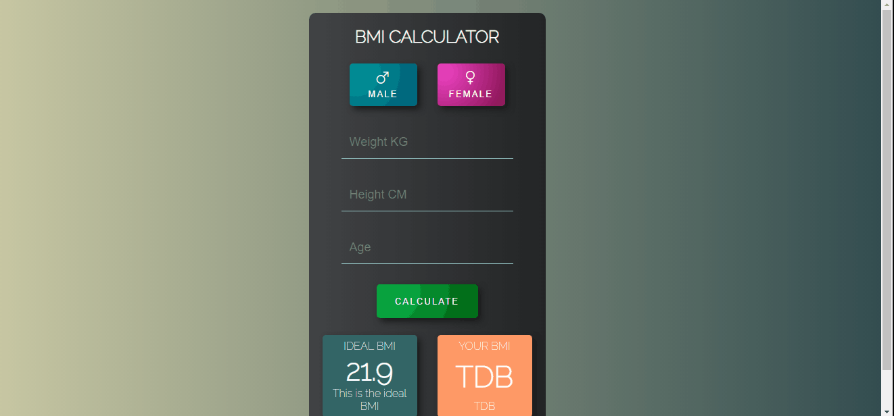

# 💪 BMI Calculator

 BMI Calculator é uma ferramenta muito útil para você que está curioso em saber qual o seu percentual de massa corporal.
    para saber o IMC basta informar à ferramenta o seu peso KG, altura CM e idade.

## ● Funcionalidades ✅
- [x] Input Weight KG
- [x] Input Height CM
- [x] Input Age
- [x] Calculate BMI

## ● ScreenShots 🖼️

● <a href='https://andersonbones.github.io/BMI-Calculator/'>DEMO 👽</a>
